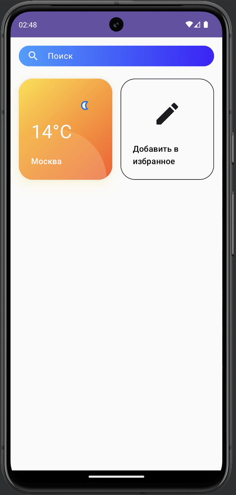
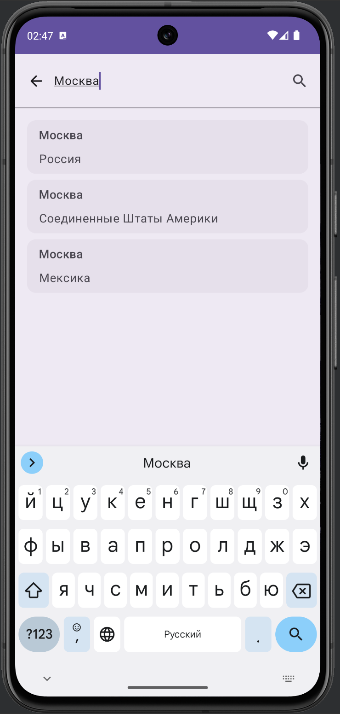
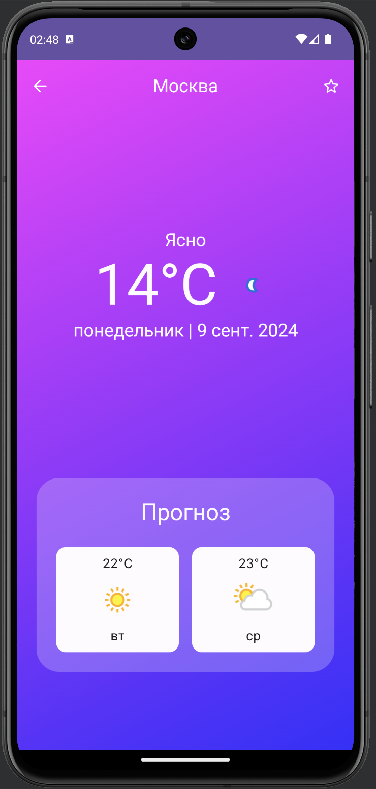

# WeatherApp

WeatherApp — это Android-приложение, предоставляющее пользователям актуальную информацию о погоде в выбранных городах. Приложение позволяет добавлять города в избранное, искать новые города, а также получать подробную информацию о погоде с помощью сервиса [WeatherAPI](https://www.weatherapi.com).

## Основные функции

- **Экран списка избранных городов**: Пользователи могут добавлять города в избранное и быстро просматривать их погоду.
- **Экран поиска городов**: Позволяет искать города через API сервиса WeatherAPI.
- **Экран погоды в городе**: Отображает информацию о текущей погоде, а также прогноз на несколько дней.

## API

Для получения данных о погоде и поиска городов используется [WeatherAPI](https://www.weatherapi.com).

## Стек используемых библиотек

Приложение разработано с использованием следующих библиотек:

- **Jetpack Compose**: Для создания современного и декларативного пользовательского интерфейса.
- **Retrofit**: Для взаимодействия с API (получение данных о погоде и поиск городов).
- **Glide (Compose)**: Для загрузки и отображения изображений (например, иконок погоды).
- **Dagger**: Для внедрения зависимостей (Dependency Injection).
- **Room**: Для локальной базы данных (сохранение избранных городов).
- **Decompose**: Для разделения логики компонентов и навигации.
- **MVI Kotlin**: Для реализации архитектуры Model-View-Intent (MVI), которая управляет состоянием приложения.
- **Coroutine Flow**: Для работы с асинхронными потоками данных.

## Скриншоты
  

## Инструкция по сборке проекта

В файл gradle.properties необходимо добавить Api Key в следующем формате:

apikey=API_KEY

Получить ключ можно на сайте https://www.weatherapi.com
